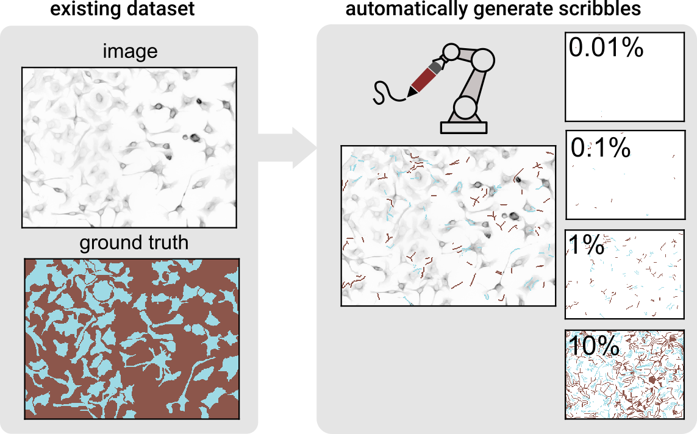

# scribbles creator

Welcome to scribbles creator. This is a little tool to automatically create scribble annotations, similar to if you would draw them by hand, based on the ground truth of an image. It can be very useful for testing tools that perform semantic segmentation based on sparse annotations. In this repository, also python scripts and notebooks are provided to test segmentation with on two different datasets: `cellpose` and `FoodSeg103`.

**If you decide to use this tool or some of the code in any sort of public work, please do contact me and cite this repository. I would be excited.**

## Installation
You can install scribbles_creator via pip using

    pip install git+https://github.com/quasar1357/scribbles_creator.git

After this, you can simply import the functions needed in Python (e.g. `from scribbles_creator import create_even_scribbles`).

## Get started
If you would like to use the scribbles_creator, the easiest way is to import and use the function `create_even_scribbles()`. Simply pass your ground truth and it will return scribble annotations. You can easily adjust the percentage of annotated pixels (`max_perc`), approximate scribble length relative to the image dimensions (`rel_scribble_len`) and scribble width (`scribble_width`).

## Main script
[scribbles_creator.py](scribbles_creator.py) is the core script, providing the functions to create scribble annotations based on a ground truth. As mentioned above, the most convenient function for straight foward scribbles creation is `create_even_scribbles(ground_truth, percent_annotation)`. Give it a try! You can also try other functions if you want to do more manual adjustments.

## Helper functions for segmentations
The scripts [convpaint_helper.py](convpaint_helper.py), [ilastik_helper.py](ilastik_helper.py) and [dino_helper.py](dino_helper.py) provide functions for semantic segmentation (here limited to training and prediction of the same image) using the three tools Convpaint (with the CNN "VGG16" as feature extractor), Ilastik (using classical filters) and DINOv2 as a feature extractor (implemented in the Convpaint framework in my work [dino_paint](https://github.com/quasar1357/dino_paint)).

## Data handlers
The scripts [cellpose_data_handler.py](cellpose_data_handler.py) and [FoodSeg103_data_handler.py](FoodSeg103_data_handler.py) provide helpful functions to handle the two datasets. In particular, they provide wrapper functions to directly create scribbles, predict segmentations using the three tools mentioned above based on images from the datasets as well as to analyse the results.

## Notebooks
These are examples for using the scripts mentioned above. They are of course specific for the respective system that is used. The workflow basically consists of these 4 steps:

1) Create **scribbles** annotations based on the ground truth provided (save them as files for reproducibility)
2) Predict semantic **segmentation** based on the scribbles, using one of the 3 tools mentioned above
3) **Analyse** the results by calculating various metrics
4) Inspect and **plot** the results

Since steps 1)-3) contain steps specific for the two datasets, separate notebooks are provided. Meanwhile, the plotting for both datasets is unified in one notebook.

## Results
The results folders contain results from my own test-runs. They can be used as references.

## Issues
If you encounter any problems, please file an [issue](https://github.com/quasar1357/scribbles_creator/issues) along with a detailed description.